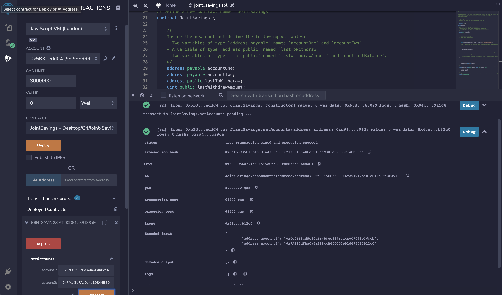
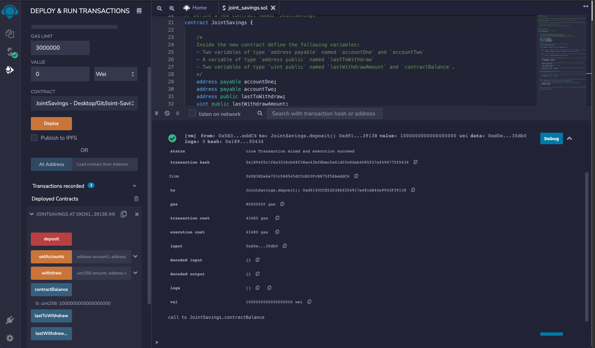
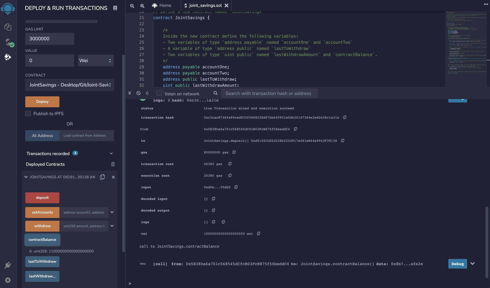
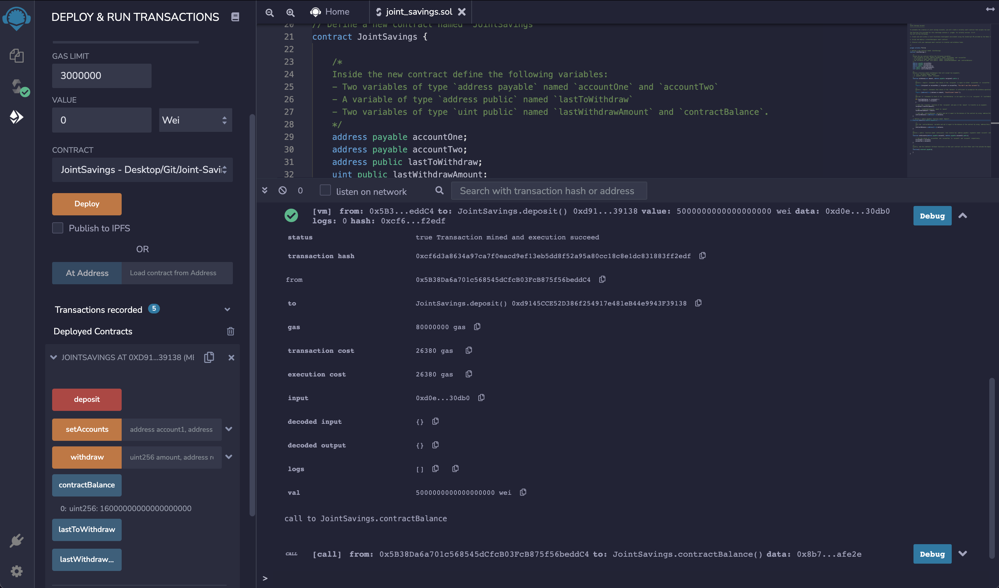
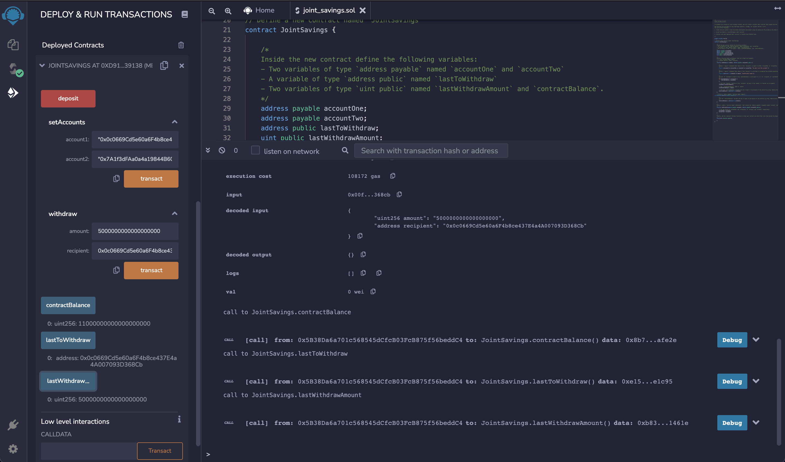
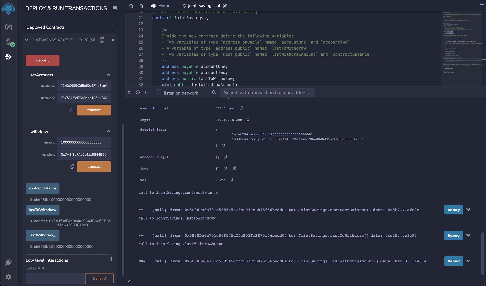

# Joint-Savings-Account

## Description

For this project, I am creating a Solidity smart contract that accepts two user addressses. These addresses will be able to control a joint savings account. The smart contract will use ether management functions to implement a financial institution’s requirements for providing the features of the joint savings account. These features will consist of the ability to deposit and withdraw funds from the account.

## Testing Procedure

1. Use the `setAccounts` function to define the authorized Ethereum address that will be able to withdraw funds from your contract.

    > Dummy account1 address: 0x0c0669Cd5e60a6F4b8ce437E4a4A007093D368Cb
    > Dummy account2 address: 0x7A1f3dFAa0a4a19844B606CD6e91d693083B12c0

2. Test the deposit functionality of your smart contract by sending the following amounts of ether. After each transaction, use the `contractBalance` function to verify that the funds were added to your contract:

    * Transaction 1: Send 1 ether as wei.

    * Transaction 2: Send 10 ether as wei.

    * Transaction 3: Send 5 ether.

3. Once funds are successfully deposited into the contract, test the contract’s withdrawal functionality by withdrawing 5 ether into `account1` and 10 ether into `account2`. After each transaction, use the `contractBalance` function to verify that the funds were withdrawn from the contract. Also, use the `lastToWithdraw` and `lastWithdrawAmount` functions to verify that the address and amount were correct.

# Execution Results

## Set Accounts

## Deposit 1 Ether as Wei

## Deposit 10 Ether as Wei

## Deposit 5 Ether as Wei

## Withdraw 5 Ether as Wei into account1

## Withdraw 10 Ether as Wei into account2
